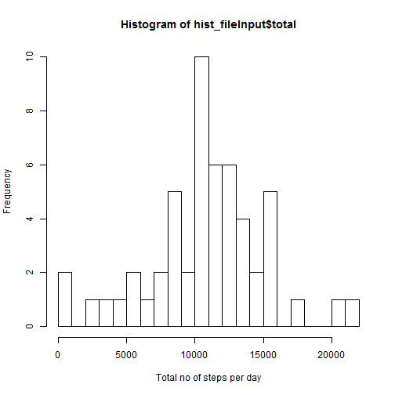
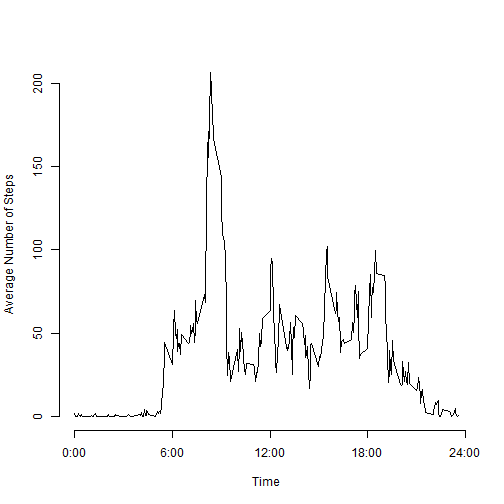
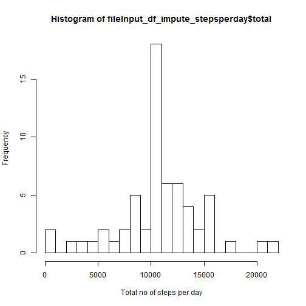

[Link to the URL](https://github.com/Mylcat/RepData_PeerAssessment1)

## Loading and preprocessing the data


```r
fileInput<-read.csv("activity.csv")
```
## Loading files into a data frame using dplyr package

```r
library(dplyr)
fileInput_df <- tbl_df(fileInput)
# Dim of the data frame
dim(fileInput_df)
```

```
## [1] 17568     3
```

```r
# Select the dataframe for NON NA in steps
fileInput_df1 <- subset(fileInput_df,!is.na(steps))
```
## What is mean total number of steps taken per day?

```r
library(plyr)

hist_fileInput<-ddply(fileInput_df1, .(date),summarise, total=sum(steps))

hist(hist_fileInput$total,breaks=20,xlab="Total no of steps per day")
```

 

```r
#Mean value 
mean_steps=mean(hist_fileInput$total,na.rm = TRUE)
mean_steps
```

```
## [1] 10766
```

```r
#Median Value
median_steps=median(hist_fileInput$total,na.rm = TRUE)
median_steps
```

```
## [1] 10765
```

## What is the average daily activity pattern?

 

```
##     interval meanSteps
## 104      835     206.2
```

```
## [1] "The interval start at 835"
```
## Imputing missing values

Calculate and report the total number of missing values in the dataset (i.e. the total number of rows with NAs)


```r
sum(is.na(fileInput_df$steps))
```

```
## [1] 2304
```

```r
fileInput_df_impute <- fileInput_df

for (i in 1:nrow(fileInput_df_impute)){
    if (is.na(fileInput_df_impute$steps[i])){
        x<-which(fileInput_df_impute$interval[i] == interval_fileInput$interval)
        fileInput_df_impute$steps[i] <- interval_fileInput$meanSteps[x]}
}

fileInput_df_impute <- arrange(fileInput_df_impute, interval)

fileInput_df_impute_stepsperday<-ddply(fileInput_df_impute, .(date),summarise, total=sum(steps))

meanImputed<-mean(fileInput_df_impute_stepsperday$total)
meanImputed
```

```
## [1] 10766
```

```r
medianImputed<-median(fileInput_df_impute_stepsperday$total)
medianImputed
```

```
## [1] 10766
```

```r
hist(fileInput_df_impute_stepsperday$total, breaks = 20, xlab="Total no of steps per day" )
```

 

```r
abs(meanImputed-mean_steps)
```

```
## [1] 0
```

```r
abs( (medianImputed-median_steps)  )
```

```
## [1] 1.189
```

```r
sprintf(" There is no change in the mean but median increased by %s",as.character(abs( (medianImputed-median_steps))))
```

```
## [1] " There is no change in the mean but median increased by 1.1886792452824"
```

## Are there differences in activity patterns between weekdays and weekends?

To find the differences in the activity patterns , day of the week and information of whether its a weekend/day 
is set into the data set. Using ddply data is summarized on 2 fields interval and weekend/day.


```r
fileInput_df_impute<-mutate(fileInput_df_impute,day=weekdays(as.Date(fileInput_df_impute$date)),week=factor(day %in% c("Saturday","Sunday"), labels=c("weekday","weekend"),ordered=FALSE))

fileInput_df_impute_Avg<-ddply(fileInput_df_impute,.(interval,week),summarise,AvgMean=mean(steps))

library(lattice)
xyplot(AvgMean ~ interval | week, data = fileInput_df_impute_Avg, layout = c(1, 2), type="l", xlab = "Interval", ylab = "Number of steps")
```

 

Data peaks are on the weekdays.  
